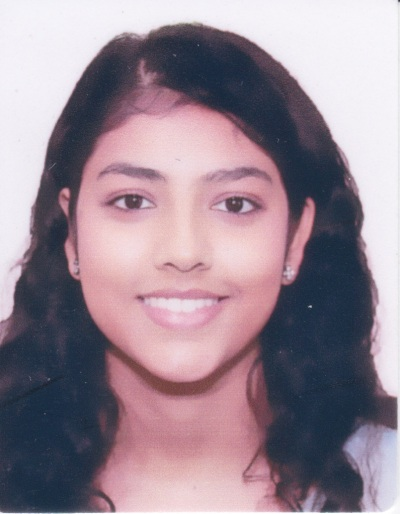

I am a postgraduate student in the University of Glasgow's
[Institute of Neuroscience and Psychology](http://www.gla.ac.uk/researchinstitutes/neurosciencepsychology/) studying Reseach Methods in Psychological Science (MSc). My dessertation uses neuroimaging techniques to study the interaction of pre- and post-decisional confidence signals and its influence on shaping decision making behaviour under the supervision of [Marios Philiastides](https://www.gla.ac.uk/researchinstitutes/neurosciencepsychology/staff/mariosphiliastides). This study aims to explore how length of exposure to perceptual stimuli affects development of choice confidence.

Prior to studying at University of Glasgow, I completed my bachelors degree in Communication and Psychology from the [State University of New York at Buffalo](https://www.buffalo.edu/) and worked as a Research Assistant at [Cultural Science Institute](https://deonlabblog.com/) at [Nanyang Technological University](http://research.ntu.edu.sg/Pages/index.aspx). In general, I am interested in the multidisciplinary approach to understanding social cognition - this ranges from social media usage and social behaviour and identity, social influence and risk aversion, social judgement of behaviours and faces in decision making and risk taking, and socio-psychological influence of bilingualism.

You can contact me via [email](bhartigupta@live.com) or find me on [LinkedIn](https://sg.linkedin.com/in/bharrrti)
